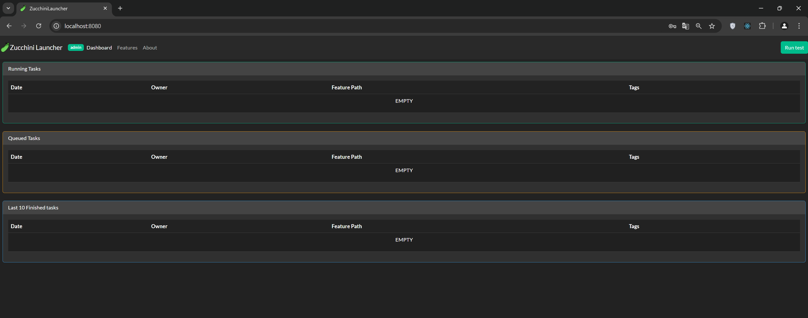
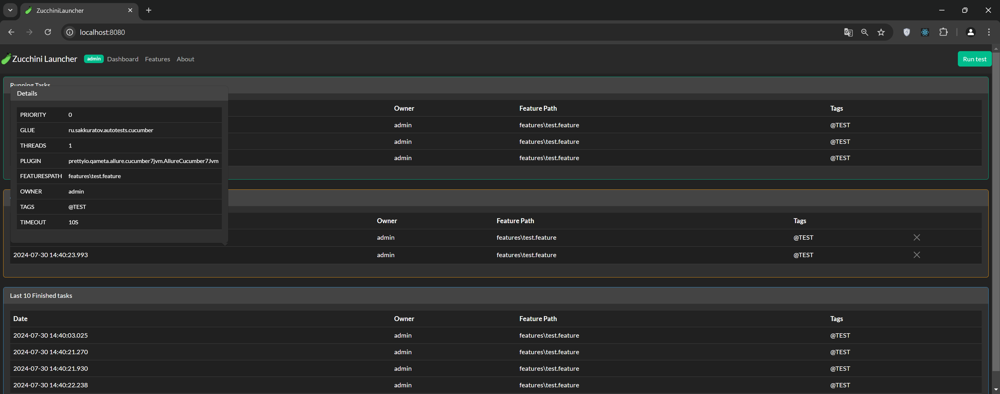
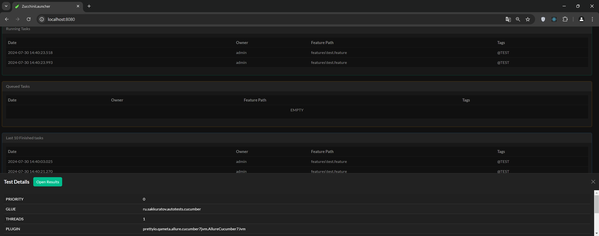
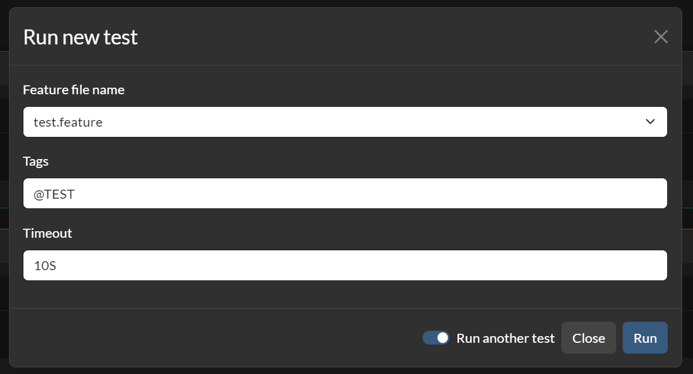
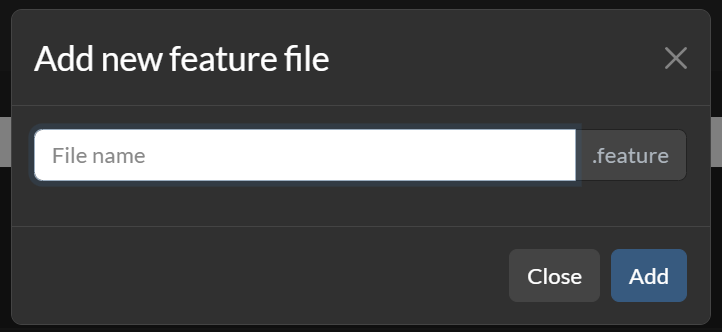

<br/>
<p align="center">
  <h3 align="center">ZucchiniLauncher</h3>
  <p align="center">
    Приложение для запуска Cucumber тестов.
    <br/>
    <br/>
  </p>
</p>

[](https://github.com/SergeyAkkuratov/ZucchiniLauncher/actions/workflows/build_deploy.yml)
 

**Backend**


**Frontend**


## Содержание

- [О проекте](#о-проекте)
- [Установка](#установка)
- [Использование](#использование)
- [Структура проекта](#структура-проекта)

## О проекте


Приложение **ZuccchiniLauncher** служит для запуска, мониторинга и обработки результатов Cucumber тестов.

## Требования

Для локального запуска приложения вам потребуется Java 17 версии или выше.

## Установка

Для локального запуска приложения вам нужно скачать
пакет [zucchini-launcher.jar](https://github.com/SergeyAkkuratov/ZucchiniLauncher/releases/tag/major).  
Далее подготовить три папки:
  - features - папка для .feature файлов. В неё тербуется сложить существующие .feature файлы. Так же в ней будут храниться файлы, созданные в ZucchiniLauncher.
  - allure-results - папка для размещения результатов тестов в Allure формате
  - allure-reports - папкв для размещения Allure Report

После этого можно запускать приложение:

```bash
java -jar zucchini-launcher.jar
```

Приложение будет доступно по адресу http://localhost:8080/.

Если вы хотите самостоятельно выполнить сборку приложения из исходного кода, то требуется склонировать проект и выполнить сборку frontend части через npm и backend части через Gradle.
После чего выполнить подготовку и запуск как указано выше.:

```bash
cd src\frontend
npm run build
cd ..\..
gradlew clean bootJar
```

Для использования Allure Report требуется запустить и настроить [allure-docker-service](https://github.com/fescobar/allure-docker-service).
Пример запуска:
```bash
docker run -p 5050:5050 -e CHECK_RESULTS_EVERY_SECONDS=3 -e KEEP_HISTORY=1 -e KEEP_HISTORY_LATEST=10 -v ./allure-results:/app/allure-results  -v ./allure-reports:/app/default-reports frankescobar/allure-docker-service
```


## Использование

### Логин

Приложение требует авторизации для просмотра и выполнения действий.
На данный момент существует две роли пользователей: user и admin.
Только пользователь с ролью admin может удалять feature файлы и тесты из очереди.


### Dashboard

Страница dashboard открывается ппосле авторизации пользователя и содержит информацию о запущенных, ожидающих и завершенных тестах.


При первональном запуске все таблицы будут пусты (так как ниодного теста ещё не было запущено):  


При наведении курсора мыши на строчку в любой таблицы будут появляться детали запуска с задержкой в 1 секунду:


Так же вы можете кликнуть по строке любой таблице, чтобы открыть окно с деталями запуска и, например, скопировать информацию.
В окне с деталями завершенного запуска вы найдете кнопку, открывающую Allure report (
требует [allure-docker-service](https://github.com/fescobar/allure-docker-service)).


### Запуск тестов

Запустить тест вы может с любой страницы программы нажам кнопку "Run test" в правом верхнем углу.
После этого откроется окно, в котором нужно будет указать параметры запуска теста:

В строке "Feature file name" нужно выбрать конкретный .feature файл для запуска. В поле Tags - указать тэги, запускаемого теста (можно посмотреть в
.feature файле). В поле таймаут указывается маскимально допустимое время выполнения теста.

Если требуется запустить больше одно теста, то можно отметить чекбокс "Run another test" и окно запуска не будет закрваться при нажатии кнопки "Run".

### Удаление тестов из очереди

Если пользователь обладает ролью admin, то он может удалять тест из очереди ожидания.
Для этого требуется нажать на крестик в соотвествующей этом тесту строке в таблице и подвердить своё действие в всплывающем окне.


### Features

На страницы Features пользователь может просмтривать, редактировать, создавать новые и удалять .feature файлы, хранящиеся на серевере.


Для того, чтобы открыть конкретный .feature файл, нужно выбрать его имя в поле "Feature file name".  
В редакторе ниже отобразится текст .feature файла.  
Если изменить текст .feature файла - станет доступна кнопка "Save changes". Нажав её можно сохранить изменение на сервере.  
Если же нажать "Cancel" - все изменения отменятся.

Для создания нового .feature файла нужно нажать на стрелочку рядом с кнопкой "Save changes" и выбрать пункт "Add new feature". После этого откроется окно:  
  
В поле "File name" нужно ввести имя нового .feature файла (расширение указывать не нужно, оно подставится автоматически).

Пользователь с ролью admin может так же удалять .feature файлы.
Для этого он должен выбрать файл и нажать кнопку "Delete". В появившемся окне требуется подтвердить своё действие.

## Структура проекта

- github
- workflows - настройки для GitHub Actions
- src
   - frontend - исходный код для Frontend
      - images - скриншоты и .gif файлы для файла README.md
      - mocks - файлы для моков тестов
      - src - исходный код проекта
         - components - React компоненты программы
         - pages - страницы приложения
         - store - описание и Redus Store приложения
   - java - исходный код для Backend
